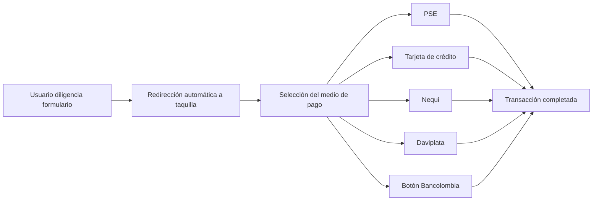

 
## Medios de pago disponibles
 
Zonaexpress permite habilitar múltiples métodos de pago dentro de la experiencia de recaudo, de forma que el usuario final pueda seleccionar el canal de pago disponible después de 
diligenciar el formulario.
 
Una vez completada la captura de información, el pagador es redirigido automáticamente a la taquilla de pagos para finalizar la transacción utilizando uno de los medios habilitados 
por el comercio.

### Medios soportados
 
| Medio de pago | Descripción |
|---|---|
| PSE | Permite realizar pagos débito desde cuentas de ahorro o corriente de entidades financieras habilitadas. |
| Tarjeta de crédito | Pago mediante tarjetas de crédito habilitadas dentro del portal de pagos. |
| Nequi | Pago utilizando saldo disponible o mecanismos autorizados dentro de la billetera digital Nequi. |
| Daviplata | Pago realizado desde la billetera digital Daviplata. |
| Botón Bancolombia | Pago directo mediante el flujo habilitado por Bancolombia para pagos digitales. |

<Nota> **Nota:** Los medios de pago disponibles para el usuario final dependerán de la configuración comercial y habilitación realizada para cada comercio. </Nota>
 
<Nota> **Importante:** Para la modalidad **Zonaexpress** no aplica el modelo de integración mediante **Caja Banco Web Services**. </Nota>

### Flujo de selección del medio de pago
 

